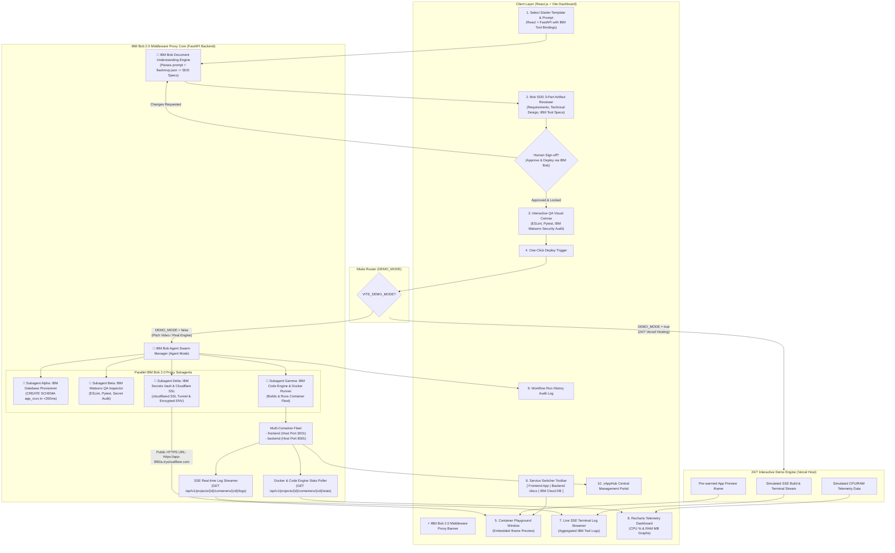

# 🚀 START HERE — FlashMVP Documentation & Specs Navigation Guide
> **Purpose:** Master guide for human developers and AI coding agents to navigate, understand, and implement the FlashMVP specifications and feature backlogs.

---

## 🧭 1. Documentation Ecosystem Overview

The `FlashMVP` repository currently contains the complete, production-grade product specifications, technical system design, and feature-driven backlogs.

```
FlashMVP/
├── START_HERE.md                        # ◄ YOU ARE HERE: Documentation Navigation Guide
├── README.md                            # High-Level Project & Documentation Index
└── docs/                                # Documentation Directory
    ├── prd.md                           # Master Product Requirement Document
    ├── architecture-system-design.md    # Complete Technical Architecture Specification
    ├── knowledge/past-discussion.md     # 3-Day Hackathon Feasibility Analysis
    ├── decisions/                       # Architectural Decision Records (ADRs)
    │   ├── README.md                    # Decisions Index
    │   └── 0001-backend-hosting-and-24-7-container-execution-strategy.md # ADR 0001: 24/7 Backend Hosting & Docker Blocker
    └── backlogs/                        # Feature-Driven Backlogs Directory
        ├── README.md                    # Master Backlog Index & Role Distribution
        ├── 10-specs-driven-development/ # Feature 1: SDD Engine & 3-Part Reviewer UI
        │   ├── 00-design-specs-driven-development.md
        │   ├── 00-overview.md
        │   ├── backend/
        │   └── frontend/
        ├── 20-application-infrastructure/ # Feature 2: Supabase Schema & Encrypted Secrets
        │   ├── 00-design-application-infrastructure.md
        │   ├── 00-overview.md
        │   ├── backend/
        │   └── frontend/
        ├── 30-expandable-architecture/  # Feature 3: Template Generator & Multi-Container Network
        │   ├── 00-design-expandable-architecture.md
        │   ├── 00-overview.md
        │   ├── backend/
        │   └── frontend/
        ├── 40-qa-pipeline-workflow/     # Feature 4: Visual QA Canvas & Run History
        │   ├── 00-design-qa-pipeline-workflow.md
        │   ├── 00-overview.md
        │   ├── backend/
        │   └── frontend/
        ├── 50-container-playground-observability/ # Feature 5: Iframe Playground & SSE Logs
        │   ├── 00-design-container-playground-observability.md
        │   ├── 00-overview.md
        │   ├── backend/
        │   └── frontend/
        └── 60-xapphub-management-portal/ # Feature 6: Application Catalog & RBAC
            ├── 00-design-xapphub-management-portal.md
            ├── 00-overview.md
            ├── backend/
            └── frontend/
```

---

## 💡 2. System Architecture & Component Interaction Flow

FlashMVP is an **Agentic Middleware Proxy** powered by **IBM Bob 2.0**. It acts as a zero-learning bridge that enables developers to build, test, and deploy applications across the **IBM Cloud & Developer Tool Ecosystem** without accessing each IBM tool individually or writing complex IaC manifests.



---

## 📄 3. Architectural Decisions (ADRs)

* 📄 **[ADR 0001: Backend Hosting & 24/7 Container Execution Strategy](file:///f:/Hackathon/FlashMVP/docs/decisions/0001-backend-hosting-and-24-7-container-execution-strategy.md)** — Evaluates local laptop vs. GCP e2-micro Always Free VPS for 24/7 backend uptime, Docker socket access, and memory safeguards (10-min idle TTL).
* 📄 **[ADR 0002: Dual-Mode Execution Strategy](file:///f:/Hackathon/FlashMVP/docs/decisions/0002-dual-mode-execution-strategy.md)** — Defines `DEMO_MODE=true` (interactive mock mode for 24/7 Vercel deployment) vs `DEMO_MODE=false` (real Docker/Supabase engine for video pitch).

---

## 📄 4. 4-Person Team Workload & Feature Directory Map

Tasks are partitioned across **4 Team Roles** for parallel development velocity:

| Role / Engineer | Assigned Domain | Assigned Backlog Items | Core Responsibilities |
| :--- | :--- | :--- | :--- |
| 🎨 **Person 1: Lead Frontend & SDD Architect** | Frontend Shell & SDD Reviewer (`client/`) | • `BL-SDD-02`<br>• `BL-SDD-03`<br>• `BL-ARC-01` | React app shell, dark glassmorphism styling, IBM Bob Header, 3-part SDD reviewer, and human sign-off lock. |
| 📊 **Person 2: Interactive QA & Observability Specialist** | QA Canvas & Observability (`client/`) | • `BL-QA-01`<br>• `BL-QA-02`<br>• `BL-QA-03`<br>• `BL-PLAY-01`<br>• `BL-PLAY-03`<br>• `BL-PLAY-04` | Visual QA node canvas, custom step builder context menu, iframe playground with service switcher, SSE log viewer, and Recharts telemetry graphs. |
| 🤖 **Person 3: IBM Agent Engine & Core Skills Engineer** | IBM Bob Agent Core & QA Engine (`server/`) | • `BL-SDD-01`<br>• `BL-SDD-03`<br>• `BL-QA-03` | FastAPI backend, IBM Bob Agent orchestrator, `bob-skill-manifest-parser` (AI prompt engine), and `bob-skill-watsonx-qa` (Watsonx audit & Pytest runner). |
| ☁️ **Person 4: IBM Cloud Infra & Skill Pack Orchestrator** | Cloud Infra & Mock Router (`server/`) | • `BL-INF-01`<br>• `BL-INF-02`<br>• `BL-ARC-01`<br>• `BL-ARC-02`<br>• `BL-ARC-03`<br>• `BL-PLAY-02`<br>• `BL-PLAY-04`<br>• `BL-HUB-01` | `bob-skill-cloud-db` (PostgreSQL schema runner `< 200ms`), `bob-skill-secrets-vault` (secrets vault & Cloudflare tunnel), `bob-skill-code-engine` (Docker runner), and `DEMO_MODE` mock engine. |

### Feature Directory & Backlog Map:

| Feature Folder | Backend Backlog (`backend/`) | Frontend Backlog (`frontend/`) |
| :--- | :--- | :--- |
| **[10-specs-driven-development](file:///f:/Hackathon/FlashMVP/docs/backlogs/10-specs-driven-development/00-overview.md)** | [BL-SDD-01 (AI Prompt Engine)](file:///f:/Hackathon/FlashMVP/docs/backlogs/10-specs-driven-development/backend/BL-SDD-01-ai-drafting-engine-and-prompt-parser.md)<br>[BL-SDD-03 (Approval Lock API)](file:///f:/Hackathon/FlashMVP/docs/backlogs/10-specs-driven-development/backend/BL-SDD-03-revision-loop-and-approval-locking-api.md) | [BL-SDD-02 (3-Part Reviewer UI)](file:///f:/Hackathon/FlashMVP/docs/backlogs/10-specs-driven-development/frontend/BL-SDD-02-three-part-artifact-review-interface.md)<br>[BL-SDD-03 (Approval Lock UI)](file:///f:/Hackathon/FlashMVP/docs/backlogs/10-specs-driven-development/frontend/BL-SDD-03-revision-loop-and-approval-locking-ui.md) |
| **[20-application-infrastructure](file:///f:/Hackathon/FlashMVP/docs/backlogs/20-application-infrastructure/00-overview.md)** | [BL-INF-01 (IBM DB Schema)](file:///f:/Hackathon/FlashMVP/docs/backlogs/20-application-infrastructure/backend/BL-INF-01-supabase-dynamic-schema-provisioner.md)<br>[BL-INF-02 (Secrets Vault API)](file:///f:/Hackathon/FlashMVP/docs/backlogs/20-application-infrastructure/backend/BL-INF-02-encrypted-secrets-vault-api.md) | [BL-INF-02 (Env Secrets Modal UI)](file:///f:/Hackathon/FlashMVP/docs/backlogs/20-application-infrastructure/frontend/BL-INF-02-environment-variables-modal-ui.md) |
| **[30-expandable-architecture](file:///f:/Hackathon/FlashMVP/docs/backlogs/30-expandable-architecture/00-overview.md)** | [BL-ARC-01 (Template Engine)](file:///f:/Hackathon/FlashMVP/docs/backlogs/30-expandable-architecture/backend/BL-ARC-01-starter-template-generator-engine.md)<br>[BL-ARC-02 (Manifest Parser)](file:///f:/Hackathon/FlashMVP/docs/backlogs/30-expandable-architecture/backend/BL-ARC-02-flashmvp-json-manifest-parser.md)<br>[BL-ARC-03 (Docker Fleet Runner)](file:///f:/Hackathon/FlashMVP/docs/backlogs/30-expandable-architecture/backend/BL-ARC-03-multi-container-docker-network-orchestrator.md) | [BL-ARC-01 (Template Selector UI)](file:///f:/Hackathon/FlashMVP/docs/backlogs/30-expandable-architecture/frontend/BL-ARC-01-starter-template-selector-ui.md) |
| **[40-qa-pipeline-workflow](file:///f:/Hackathon/FlashMVP/docs/backlogs/40-qa-pipeline-workflow/00-overview.md)** | [BL-QA-03 (Run History API)](file:///f:/Hackathon/FlashMVP/docs/backlogs/40-qa-pipeline-workflow/backend/BL-QA-03-workflow-run-history-api.md) | [BL-QA-01 (Visual QA Canvas UI)](file:///f:/Hackathon/FlashMVP/docs/backlogs/40-qa-pipeline-workflow/frontend/BL-QA-01-interactive-visual-node-canvas.md)<br>[BL-QA-02 (Context Menu Modal UI)](file:///f:/Hackathon/FlashMVP/docs/backlogs/40-qa-pipeline-workflow/frontend/BL-QA-02-context-menu-and-custom-step-builder.md)<br>[BL-QA-03 (Run History UI Drawer)](file:///f:/Hackathon/FlashMVP/docs/backlogs/40-qa-pipeline-workflow/frontend/BL-QA-03-workflow-run-history-and-detail-inspector-ui.md) |
| **[50-container-playground-observability](file:///f:/Hackathon/FlashMVP/docs/backlogs/50-container-playground-observability/00-overview.md)** | [BL-PLAY-02 (Cloudflare Tunnel)](file:///f:/Hackathon/FlashMVP/docs/backlogs/50-container-playground-observability/backend/BL-PLAY-02-cloudflare-quick-tunnel-manager.md)<br>[BL-PLAY-04 (SSE Logs & Stats API)](file:///f:/Hackathon/FlashMVP/docs/backlogs/50-container-playground-observability/backend/BL-PLAY-04-container-telemetry-and-sse-log-streamer-api.md) | [BL-PLAY-01 (Iframe Playground UI)](file:///f:/Hackathon/FlashMVP/docs/backlogs/50-container-playground-observability/frontend/BL-PLAY-01-embedded-iframe-playground-and-viewport-controls.md)<br>[BL-PLAY-03 (Service Switcher UI)](file:///f:/Hackathon/FlashMVP/docs/backlogs/50-container-playground-observability/frontend/BL-PLAY-03-multi-service-switcher-toolbar.md)<br>[BL-PLAY-04 (Telemetry & Log UI)](file:///f:/Hackathon/FlashMVP/docs/backlogs/50-container-playground-observability/frontend/BL-PLAY-04-container-fleet-telemetry-and-log-viewer-ui.md) |
| **[60-xapphub-management-portal](file:///f:/Hackathon/FlashMVP/docs/backlogs/60-xapphub-management-portal/00-overview.md)** | [BL-HUB-01 (Catalog API)](file:///f:/Hackathon/FlashMVP/docs/backlogs/60-xapphub-management-portal/backend/BL-HUB-01-central-application-catalog-api.md) | [BL-HUB-01 (Catalog Grid UI)](file:///f:/Hackathon/FlashMVP/docs/backlogs/60-xapphub-management-portal/frontend/BL-HUB-01-central-application-catalog-ui.md)<br>[BL-HUB-02 (RBAC & Analytics UI)](file:///f:/Hackathon/FlashMVP/docs/backlogs/60-xapphub-management-portal/frontend/BL-HUB-02-access-control-and-adoption-analytics-ui.md) |


---

## 🤖 4. How to Read and Implement a Task (For AI Agents & Developers)

When an AI coding agent or human developer starts working on a feature:

1. **Step 1: Open the Target Feature Directory**
   * Open the feature folder in `docs/backlogs/` (e.g. `docs/backlogs/40-qa-pipeline-workflow/`).
2. **Step 2: Read the Architectural Design Document (`00-design-*.md`)**
   * Read `00-design-*.md` to understand the state machine, diagrams, API table, edge cases, and acceptance criteria.
3. **Step 3: Open the Specific Backlog Item (`BL-*.md`)**
   * Open your assigned item in `backend/` or `frontend/` (e.g. `frontend/BL-QA-01-interactive-visual-node-canvas.md`).
4. **Step 4: Implement Code & Follow Test Guide**
   * Implement the component or service at the exact file path indicated.
   * Follow the **Testing & Verification Guide** inside the backlog file to test your work independently!
