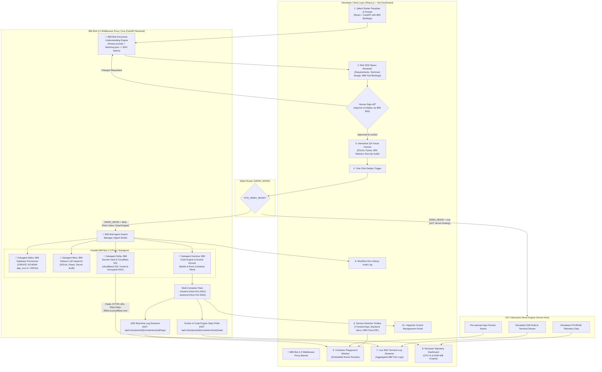

# FlashMVP - System Architecture & Technical Design Specification
> **IBM Bob 2.0 Powered Middleware Proxy & Developer Platform** | Zero-Learning Integration with IBM Cloud & Developer Tools

---

## 1. Executive Summary & Design Philosophy

FlashMVP functions as an **Agentic Middleware Proxy** powered by **IBM Bob 2.0**. Its purpose is to bridge developer application templates directly into the **IBM Cloud & Developer Tool Ecosystem** without requiring developers to log into separate IBM web consoles, manage complex IAM credentials, or write custom IaC manifests.

FlashMVP abstracts IBM tool complexity using three core mechanisms:
1. **IBM Tool Binding Manifests (`flashmvp.json`):** Pre-packaged starter templates equipped with IBM service definitions (`ibm-code-engine`, `ibm-postgres-db`, `ibm-secrets-manager`, `ibm-watsonx-qa`).
2. **IBM Bob 2.0 Document & Prompt Understanding:** Converts user prompts and manifest files into locked Specs-Driven Development (SDD) plans.
3. **IBM Bob Parallel Subagent Proxy Swarm:** Concurrently dispatches 4 subagents to provision IBM databases, run QA checks, deploy containers to IBM Code Engine / local engine, and manage secrets.

---

## 2. Recommended Technology Stack & IBM Tool Proxy Mappings

| Layer | Technology | Role as IBM Tool Proxy |
| :--- | :--- | :--- |
| **Frontend UI** | **React.js + Vite** | Single-pane-of-glass dashboard for previewing apps, switching service views, and monitoring IBM tool status. |
| **Styling & Visuals** | **Vanilla CSS + Glassmorphism** | Modern, premium dark mode UI with interactive subagent telemetry cards. |
| **Agent Engine Core**| **IBM Bob 2.0 Agent Engine** | Orchestrates Agent Mode execution, document understanding, and parallel subagent proxy delegation. |
| **Backend Middleware**| **FastAPI (Python 3.11+)** | High-performance middleware proxy executing async IBM API calls, `docker-py`, and Supabase SQL runner. |
| **Database Layer** | **IBM Cloud DB / Supabase PG** | Isolated PostgreSQL tenant schemas (`CREATE SCHEMA app_xxxx`) provisioned in `< 200ms` by Bob DB Subagent. |
| **Compute / Deploy** | **IBM Code Engine / Docker Engine**| Automated multi-container build & serverless deployment managed by Bob Fleet Subagent. |
| **Secrets & SSL Vault**| **IBM Secrets Manager / Cloudflare**| Encrypted vault injection (`-e KEY=VAL`) and instant SSL HTTPS tunneling (`*.trycloudflare.com`). |

---

## 3. Core Architecture & Middleware Proxy Diagram



---

## 4. Deep-Dive Strategy & Transparent Execution Pipeline

### 🟢 1. Database Strategy: Supabase Schema Isolation + Transparent Status
* **The Approach:** Pre-created single Supabase project with dynamic PostgreSQL schema creation (`CREATE SCHEMA IF NOT EXISTS app_proj_8f92a`).
* **Transparent UI Feedback:** The platform UI explicitly displays the database setup step with timing metrics:
  * `[✓] Supabase Connection Established`
  * `[✓] Executing SQL: CREATE SCHEMA app_proj_8f92a (0.18s)`
  * `[✓] Applying Row-Level Security Policies & Migrations`

---

### 🟢 2. Quick Deployable Apps: Multi-Container Docker Networks & Cloudflared
* **Multi-Container Support (Separate Frontend & Backend):**
  * When a user generates an app with separate frontend (e.g., React/Next.js) and backend (e.g., FastAPI/Go) containers:
    1. FastAPI creates a dedicated isolated Docker Network (`docker.networks.create(f"net_{project_id}")`).
    2. Launches `backend_container` attached to the network on host port `:8001`.
    3. Launches `frontend_container` attached to the network on host port `:3001`, injecting `API_URL` into environment variables.
    4. Both containers connect to the pre-isolated Supabase schema (`app_{project_id}`).
* **Instant Public HTTPS (Cloudflare Tunnels):** 
  * FastAPI triggers a Cloudflare Quick Tunnel (`cloudflared tunnel --url http://localhost:3001`).
  * Generates an instant, free SSL URL (`https://app-8f92a.trycloudflare.com`) in 1-2 seconds.
* **Transparent UI Feedback & Service Inspector:** 
  * The React Playground provides a **Service Switcher**:
    * `🌐 Frontend Preview (Iframe)`
    * `⚙️ Backend API Docs (/docs)`
    * `🛢️ Supabase DB Schema`
  * Logs panel provides tab switching between `[Frontend Logs]` and `[Backend Logs]`.
  * Telemetry charts display live CPU/RAM metrics for **both containers side-by-side**.

---

### 🟢 3. Interactive QA Workflow & Historical Runs (Vercel / GitHub Actions Style)
* **Visual Node Canvas:** Interactive node graph for QA steps (`Step 1: ESLint` -> `Step 2: Pytest` -> `Step 3: Secret Scan`).
  * Right-click context menu to "Add Custom QA Step", drag-to-reorder, and edit shell commands.
* **Workflow Run History (Vercel / GitHub Actions UI):**
  * Maintains a complete audit log of past deployment & QA workflow runs:
    * `Run #14` - `Commit 8f92a` | `🟢 Passed (32s ago)` | `Duration: 18s`
    * `Run #13` - `Commit 3b10c` | `🔴 Failed on Step 2: Pytest (2h ago)`
  * **Run Detail Inspection:** Clicking any historical run loads its snapshot, exact step pass/fail states, archived build logs, and environment variables used.

---

### 🟢 4. Template Generator Engine & Project Connection (`flashmvp.json`)
* **How User Projects Connect to FlashMVP:**
  1. **Starter Template Scaffolding:** 
     * FlashMVP includes a **Template Generator Engine** with pre-configured full-stack templates (e.g., `React + FastAPI`, `Next.js + Go`, `Node + Express`).
     * When a project is created, FlashMVP scaffolds the code files, initializes a local Git repo, and (optionally) syncs to a managed GitHub repository.
  2. **FlashMVP Manifest (`flashmvp.json`):**
     * Every generated template includes a lightweight configuration manifest:
       ```json
       {
         "name": "my-app",
         "template": "react-fastapi",
         "database": { "schema": "app_my_app_8f92a" },
         "services": [
           { "name": "frontend", "dockerfile": "Dockerfile.frontend", "port": 3000 },
           { "name": "backend", "dockerfile": "Dockerfile.backend", "port": 8000 }
         ],
         "qa_pipeline": [
           { "id": "lint", "name": "ESLint", "command": "npm run lint" },
           { "id": "test", "name": "Pytest", "command": "pytest" }
         ]
       }
       ```
  3. **Seamless Execution Trigger:**
     * When the user (or AI Coding Agent) modifies code and clicks **Deploy**, FlashMVP reads `flashmvp.json`, executes the QA pipeline steps, builds the Docker containers, attaches the isolated Supabase schema, and provisions the Cloudflare Tunnel URL!

---

### 🟢 5. Container Fleet Observability & Multi-Container Log Streaming
* **Container Fleet Status:** 
  * Lists all active containers belonging to the project (e.g., `frontend`, `backend`, `redis_cache`).
  * Displays exact status badges (`RUNNING`, `HEALTHY`, `CRASHED`, `EXITED (code 1)`, `RESTARTING`).
* **Live Per-Container Log Viewer:**
  * Dropdown/Tab selector to switch between containers (`frontend_container`, `backend_container`).
  * Streams live stderr/stdout logs using FastAPI SSE (`/api/v1/projects/{id}/containers/{container_id}/logs`).
  * Instant filter & search inside log viewer to debug startup failures or runtime exceptions.
* **Real-time Docker Telemetry:**
  * Queries `container.stats()` every 3 seconds for CPU %, RAM MB, and Network I/O for each container in the project fleet.

---

### 🟢 6. Environment Variables & Secrets Management Menu
* **Environment Configuration Modal:**
  * Dedicated UI menu for setting project environment variables and API keys (e.g. `OPENAI_API_KEY`, `STRIPE_SECRET_KEY`, `DATABASE_URL`, `JWT_SECRET`).
* **Target Scoping:**
  * Key-Value pairs can be scoped to specific targets: `All Containers`, `Frontend Only`, or `Backend Only`.
* **Security & Injection:**
  * Secrets are stored encrypted at rest using envelope encryption (KMS).
  * Automatically injected into Docker container runtimes (`-e KEY=VAL`) and synced with the project `.env` scaffold.

---

## 5. API Endpoints Architecture (FastAPI)

| Method | Endpoint | Description |
| :--- | :--- | :--- |
| `POST` | `/api/v1/specs/generate` | Generates 3-part SDD specs (Requirements, Design, Tasks). |
| `POST` | `/api/v1/specs/approve` | Locks spec and approves project for generation. |
| `POST` | `/api/v1/projects/create` | Provisions database schema (`app_{id}`) in Supabase & creates repo scaffold. |
| `GET` | `/api/v1/projects/{id}/containers` | Lists all containers in project fleet with status, ports, and health. |
| `GET` | `/api/v1/projects/{id}/containers/{cid}/logs` | SSE stream for real-time stdout/stderr logs of a specific container. |
| `GET` | `/api/v1/projects/{id}/containers/{cid}/stats` | Real-time CPU, RAM, and Network telemetry for a container. |
| `GET/POST`| `/api/v1/projects/{id}/env` | Gets and updates encrypted environment variables & API keys. |
| `POST` | `/api/v1/projects/{id}/qa/steps` | Adds, updates, or reorders custom QA pipeline steps. |
| `POST` | `/api/v1/projects/{id}/deploy` | Executes interactive QA pipeline, builds images, attaches env vars, launches containers, and establishes Cloudflare Tunnels. |
| `GET` | `/api/v1/projects` | Lists all published apps for the xAppHub Portal. |

---

## 6. Verification & Feasibility Audit

| Constraint | Evaluation | Risk Mitigation |
| :--- | :--- | :--- |
| **3-Day Sprint Feasibility** | **HIGH** | Using single Supabase instance + local Docker removes 90% of DevOps failure points. |
| **Demo Impact ("Vibe")** | **VERY HIGH** | Real-time SSE streaming logs, instantaneous DB schema creation, and live container metrics charts make the platform look like a enterprise cloud solution. |
| **Stack Complexity** | **LOW** | React (UI) + FastAPI (API) + Docker (Runner) + Supabase (Database) is lean and clean. |
