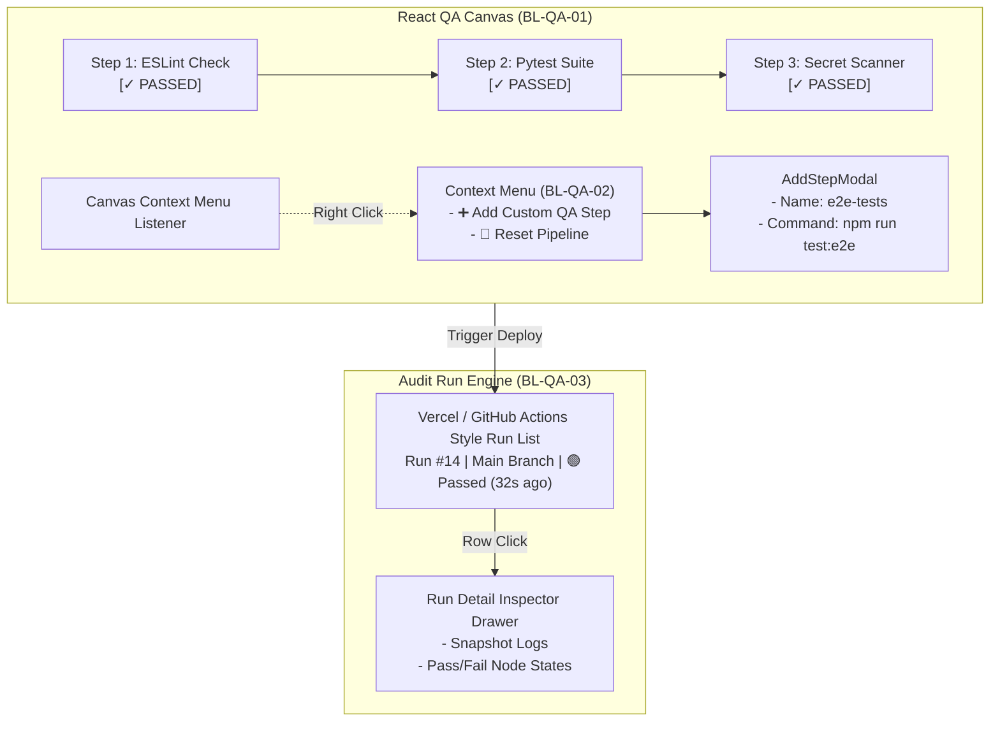

# QA Pipeline Workflow — Design Specification

| Header | Details |
| :--- | :--- |
| **Author** | FlashMVP Architecture Team |
| **Status** | Approved for Implementation |
| **Implements** | PRD §2.3 (FR3: QA Pipeline & Workflow History) |
| **Implemented by** | `BL-QA-01` (Interactive Canvas UI, FE) · `BL-QA-02` (Context Menu & Custom Step Builder, FE) · `BL-QA-03` (Workflow Run History & Detail Inspector, BE/FE) |

---

## 1. Feature Overview & Purpose

The QA Pipeline Workflow feature provides a visual node canvas representing QA execution steps (`Step 1: ESLint` ➔ `Step 2: Pytest` ➔ `Step 3: Secret Scan`). 

Users can interact with the canvas via a right-click context menu to add custom pipeline steps, reorder execution sequence, and inspect historical workflow runs in a Vercel / GitHub Actions style audit log.

---

## 2. Interactive QA Canvas Architecture & Right-Click Context Menu



---

## 3. Workflow Run States & Node Lifecycle

```
        ┌──────────────┐
        │   disabled   │  Step toggled off by user
        └──────────────┘

        ┌──────────────┐
        │   pending    │  Queued in pipeline
        └──────┬───────┘
               │
               ▼
        ┌──────────────┐
        │   running    │  Executing shell command
        └──────┬───────┘
               │
       ┌───────┴───────┐
       ▼               ▼
┌──────────────┐ ┌──────────────┐
│    passed    │ │    failed    │  Pipeline halts; error log rendered
└──────────────┘ └──────────────┘
```

---

## 4. Workflow Run History Audit Schema (Vercel / GitHub Actions Style)

Every deployment attempt creates an immutable workflow run audit log row:

```json
{
  "run_number": 14,
  "project_id": "proj_8f92a",
  "commit": "8f92a1",
  "branch": "main",
  "status": "PASSED",
  "duration_seconds": 18,
  "timestamp": "2026-09-25T11:30:00Z",
  "step_results": [
    { "id": "s1", "name": "ESLint Check", "status": "PASSED", "duration": "3s" },
    { "id": "s2", "name": "Pytest Suite", "status": "PASSED", "duration": "11s" },
    { "id": "s3", "name": "Secret Scanner", "status": "PASSED", "duration": "4s" }
  ],
  "logs_snapshot_url": "/api/v1/runs/14/logs"
}
```

---

## 5. API Surface & Endpoints

| Method | Endpoint | Role | Description |
| :--- | :--- | :--- | :--- |
| `GET` | `/api/v1/projects/{id}/qa/steps` | BE | Fetches configured pipeline step nodes. |
| `POST` | `/api/v1/projects/{id}/qa/steps` | BE/FE | Adds, updates, or reorders custom QA pipeline steps. |
| `GET` | `/api/v1/projects/{id}/runs` | BE | Lists historical workflow run audit logs. |
| `GET` | `/api/v1/projects/{id}/runs/{run_id}` | BE | Returns detail snapshot and archived build logs for a run. |

---

## 6. Edge Cases & Verification Criteria

| # | Edge Case | Expected Behavior |
| :--- | :--- | :--- |
| **E1** | Pipeline step fails (exit code > 0) | Halts pipeline immediately, marks step `🔴 FAILED`, logs stderr traceback, and cancels subsequent steps. |
| **E2** | Custom step contains malicious command (`rm -rf /`) | Sanitizes command execution within restricted container sandbox. |
| **E3** | User right-clicks outside canvas bounds | Native browser context menu renders normally; canvas menu triggers only inside QA canvas viewport. |

---

## 7. Acceptance Criteria for Implementing Items

* **BL-QA-01 (Frontend):** React node graph renders sequential steps with active status badges (`🟢 PASSED`, `🔴 FAILED`, `🟡 RUNNING`).
* **BL-QA-02 (Frontend):** Right-click context menu opens `AddStepModal`, appending new custom steps (`npm run test:e2e`) to the pipeline.
* **BL-QA-03 (Fullstack):** Run history table displays Vercel-style past runs; clicking a row opens the detail inspector drawer showing archived logs.
