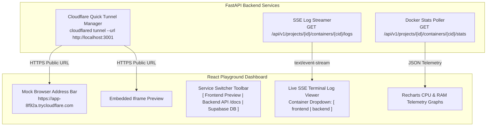

# Container Playground & Observability — Design Specification

| Header | Details |
| :--- | :--- |
| **Author** | FlashMVP Architecture Team |
| **Status** | Approved for Implementation |
| **Implements** | PRD §2.4 (FR4: Real-time Telemetry & Container Observability) |
| **Implemented by** | `BL-PLAY-01` (Iframe Playground & Viewports, FE) · `BL-PLAY-02` (Cloudflare Quick Tunnel, BE) · `BL-PLAY-03` (Service Switcher Toolbar, FE) · `BL-PLAY-04` (Fleet Telemetry & SSE Logs, BE/FE) |

---

## 1. Feature Overview & Purpose

The Container Playground & Observability feature provides an interactive web preview inside an embedded iframe, free SSL public links via Cloudflare Quick Tunnels (`https://xxxx.trycloudflare.com`), a multi-service switcher (`Frontend App`, `Backend API /docs`, `Supabase DB`), real-time CPU/RAM telemetry charts, and per-container SSE stdout/stderr log streaming.

---

## 2. Interactive Playground & Observability Architecture



---

## 3. Cloudflare Quick Tunnel Integration

Cloudflare Quick Tunnels (`cloudflared`) provide free, instant SSL public URLs without warning interstitial pages or rate limits:

```python
# Executed by Backend Subprocess Service (BL-PLAY-02)
proc = subprocess.Popen(
    ["cloudflared", "tunnel", "--url", "http://localhost:3001"],
    stderr=subprocess.PIPE,
    text=True
)
# Parses output URL: https://app-8f92a.trycloudflare.com
```

---

## 4. Multi-Service Switcher Toolbar

The Service Switcher toolbar updates the iframe target URL dynamically based on selected tab:

| Tab Choice | Target URL Pattern | Description |
| :--- | :--- | :--- |
| `🌐 Frontend App` | `https://app-8f92a.trycloudflare.com` | Live React/Next.js application preview |
| `⚙️ Backend API (/docs)` | `http://localhost:8001/docs` | Interactive FastAPI Swagger documentation |
| `🛢️ Supabase DB` | Schema inspector mock | Dynamic database table & schema inspector |

---

## 5. API Surface & Endpoints

| Method | Endpoint | Role | Description |
| :--- | :--- | :--- | :--- |
| `GET` | `/api/v1/projects/{id}/containers` | BE | Lists active containers in fleet (`id`, `name`, `status`, `port`, `preview_url`). |
| `GET` | `/api/v1/projects/{id}/containers/{cid}/logs` | BE/FE | SSE stream for real-time stdout/stderr logs of a specific container. |
| `GET` | `/api/v1/projects/{id}/containers/{cid}/stats` | BE/FE | Returns real-time CPU %, RAM MB, and Net I/O telemetry. |

---

## 6. Edge Cases & Verification Criteria

| # | Edge Case | Expected Behavior |
| :--- | :--- | :--- |
| **E1** | Cloudflare tunnel binary missing | Fallbacks gracefully to local URL (`http://localhost:3001`) with clear UI warning badge. |
| **E2** | Container crashes mid-stream | Log viewer displays exit code `🔴 Container Exited (Code 1)`, stops SSE poller, and surfaces stack trace. |
| **E3** | Rapid tab switching in service switcher | Aborts previous iframe loading requests to prevent race conditions. |

---

## 7. Acceptance Criteria for Implementing Items

* **BL-PLAY-01 (Frontend):** Playground frame renders embedded iframe with browser header and responsive viewport toggles (`Desktop`, `Mobile 375px`).
* **BL-PLAY-02 (Backend):** Tunnel manager executes `cloudflared` and returns `https://xxxx.trycloudflare.com` URL within 1.5 seconds.
* **BL-PLAY-03 (Frontend):** Service switcher switches iframe preview between Frontend App, Backend API `/docs`, and DB inspector.
* **BL-PLAY-04 (Fullstack):** Terminal log viewer streams real-time SSE logs per container, and Recharts graphs live CPU & RAM usage.
