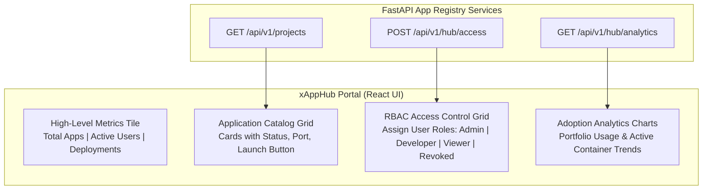

# xAppHub Management Portal — Design Specification

| Header | Details |
| :--- | :--- |
| **Author** | FlashMVP Architecture Team |
| **Status** | Approved for Implementation |
| **Implements** | PRD §2.5 (FR5: Centralized Portfolio Governance Portal) |
| **Implemented by** | `BL-HUB-01` (Central Application Catalog, BE/FE) · `BL-HUB-02` (Access Control & Analytics, FE) |

---

## 1. Feature Overview & Purpose

The xAppHub Management Portal serves as a centralized single-pane-of-glass governance dashboard for software builders and platform administrators to oversee an application portfolio. 

It provides capabilities to publish newly generated apps, manage role-based user access controls (RBAC), and monitor usage/adoption telemetry across all deployed applications.

---

## 2. Portal Architecture & Data Flow

---

## 3. Role-Based Access Control (RBAC) Matrix

| Role | Catalog View | Deploy App | Edit Env Secrets | Revoke User Access |
| :--- | :--- | :--- | :--- | :--- |
| **Super Admin** | ✅ | ✅ | ✅ | ✅ |
| **Developer** | ✅ | ✅ | ✅ | ❌ |
| **Viewer** | ✅ | ❌ | ❌ | ❌ |
| **Revoked** | ❌ | ❌ | ❌ | ❌ |

---

## 4. API Surface & Endpoints

| Method | Endpoint | Role | Description |
| :--- | :--- | :--- | :--- |
| `GET` | `/api/v1/projects` | BE/FE | Returns array of published applications with metadata and URLs. |
| `POST` | `/api/v1/hub/access` | BE/FE | Updates RBAC user permissions for an application. |
| `GET` | `/api/v1/hub/analytics` | BE/FE | Returns portfolio usage and adoption telemetry metrics. |

---

## 5. Edge Cases & Verification Criteria

| # | Edge Case | Expected Behavior |
| :--- | :--- | :--- |
| **E1** | Application owner leaves organization | Reassigns application ownership automatically to default Super Admin. |
| **E2** | Bulk access revocation | Requires confirmation modal to prevent accidental lockout of critical tools. |
| **E3** | Telemetry poller outage | Renders cached usage metrics with warning indicator. |

---

## 6. Acceptance Criteria for Implementing Items

* **BL-HUB-01 (Fullstack):** App catalog renders responsive grid of published application cards with live status indicators and quick preview launch buttons.
* **BL-HUB-02 (Frontend):** Access control grid allows assigning/revoking user roles, and adoption analytics renders portfolio usage trends.
