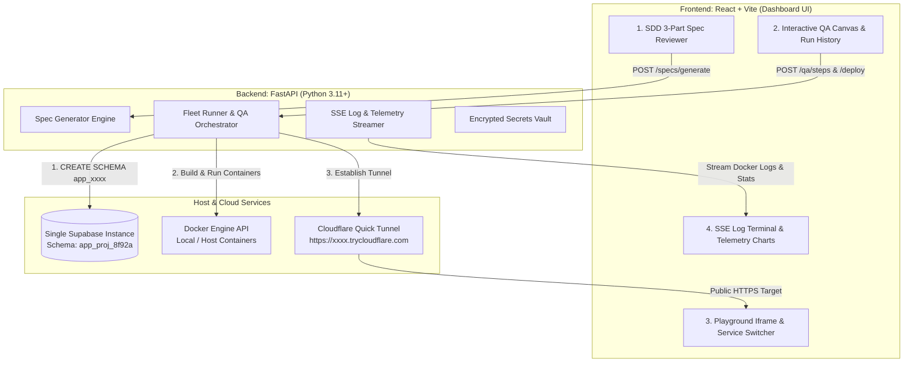

# Product Requirement Document (PRD) — FlashMVP
> **Version:** 2.1.0 (Hackathon Edition — IBM Bob 2.0 Track)  
> **Theme Alignment:** IBM Bob 2.0 Environment Skill Pack & Zero-Learning Developer Middleware  
> **Powered By:** IBM Bob 2.0 Agent Engine (Agent Mode, Parallel Subagent Swarm, Environment Skills)  
> **Target Stack:** React.js + FastAPI + IBM Bob 2.0 Skill Pack + IBM Cloud Code Engine + IBM Cloud DB + Cloudflared  

---

## 1. Product Vision & Strategic Goals

**FlashMVP** is an agentic platform and **Environment Skill Pack for IBM Bob 2.0**. It equips the **IBM Bob 2.0 Agent Engine** with custom, pre-built **Infrastructure & Tool Skills** (`bob-skill-code-engine`, `bob-skill-cloud-db`, `bob-skill-secrets-vault`, `bob-skill-watsonx-qa`) so that IBM Bob can autonomously provision, test, build, and deploy full-stack applications across the **IBM Cloud & Developer Tool Ecosystem** without developers ever needing to learn separate IBM CLIs or manually configure IBM web consoles.

By providing IBM Bob 2.0 with these **Environment Skills**, FlashMVP enables a 1-click **Spec-to-Release Workflow**, reducing total environment setup and deployment time from **hours to 4 seconds (a 99.6% reduction in friction)**.

---

## 1.1 Problem Statement: Missing Environment Skills & Tool Friction

### 🔴 The Problem in Today's Developer Workflow:

1. **IBM Bob Lacks Pre-Built Infrastructure Skills (High Learning Curve):**
   * Without custom environment skills, AI agents can only write code snippets—they cannot provision cloud databases, create serverless container fleets, or configure security vaults autonomously.
   * Developers must manually execute 10+ steps across separate IBM web consoles (Code Engine, Cloud Databases, Secrets Manager, IAM roles).

2. **Manual Integration & Deployment Overhead (High Error Rate):**
   * Manually wiring database credentials, environment vault keys, and container registries across IBM tools creates broken connections, security flaws, and multi-hour setup delays (2 to 4 hours per project).

---

## 1.2 The FlashMVP Solution: The IBM Bob 2.0 Environment Skill Pack

FlashMVP provides **IBM Bob 2.0** with a modular suite of **Environment Skills** that automate end-to-end cloud operations:

```
┌──────────────────────────────────────────────────────────────────────────────────────────────────┐
│                                  FlashMVP Middleware Platform                                    │
│                 [⚡ IBM Bob 2.0 Agent Engine equipped with FlashMVP Skill Pack]                  │
└────────────────────────────────────────────────┬─────────────────────────────────────────────────┘
                                                 │ Executes Parallel Skills
                                                 ▼
┌──────────────────────────────────────────────────────────────────────────────────────────────────┐
│                                 IBM Bob 2.0 Environment Skills                                   │
├──────────────────────────┬──────────────────────────┬──────────────────────┬─────────────────────┤
│ 🛠️ bob-skill-cloud-db    │ 🛠️ bob-skill-watsonx-qa │ 🛠️ bob-skill-code-eng│ 🛠️ bob-skill-vault  │
│ [DB Schema Provisioner]  │ [Watsonx Audit & Tests]  │ [Code Engine Fleet]  │ [Secrets Manager]   │
└───────────┬──────────────┴────────────┬─────────────┴──────────┬───────────┴──────────┬──────────┘
            │                           │                        │                      │
            ▼                           ▼                        ▼                      ▼
┌──────────────────────┐    ┌──────────────────────┐   ┌───────────────────┐  ┌────────────────────┐
│ IBM Cloud Databases  │    │ IBM Watsonx / Bob    │   │ IBM Cloud Code    │  │ IBM Secrets        │
│ for PostgreSQL       │    │ Security Audit       │   │ Engine Containers │  │ Manager Vault      │
└──────────────────────┘    └──────────────────────┘   └───────────────────┘  └────────────────────┘
```

* 🛠️ **`bob-skill-manifest-parser` (Document Understanding):**
  * Parses natural language prompts and starter templates containing `flashmvp.json`.
  * Generates a 3-part Specs-Driven Development (SDD) artifact requiring human sign-off before code execution.
* 🛠️ **`bob-skill-cloud-db` (IBM Database Provisioner):**
  * Provisions isolated PostgreSQL tenant schemas (`CREATE SCHEMA app_xxxx`) in `< 200ms` inside IBM Cloud Databases / Supabase.
* 🛠️ **`bob-skill-watsonx-qa` (IBM Watsonx QA Inspector):**
  * Executes parallel ESLint linting, Pytest unit tests, and IBM Watsonx security vulnerability scans.
* 🛠️ **`bob-skill-code-engine` (IBM Code Engine Fleet Runner):**
  * Builds Docker images and deploys multi-container fleets (`frontend`, `backend`) to IBM Cloud Code Engine or local runtime.
* 🛠️ **`bob-skill-secrets-vault` (IBM Secrets Manager Proxy):**
  * Syncs API keys, database credentials, and Cloudflare SSL HTTPS public links (`https://xxxx.trycloudflare.com`).


---

## 1.3 Quantifiable Impact Metrics

| Workflow Metric | Today's Baseline (Manual IBM Tools) | With FlashMVP Middleware Proxy | Quantifiable Impact |
| :--- | :--- | :--- | :--- |
| **IBM Multi-Tool Setup & DB Provisioning** | ~2 to 4 hours (Across 5 consoles) | **~4 seconds (1-Click Proxy)** | ⚡ **99.6% Faster Release** |
| **Manual DevOps, IAM & YAML Auth** | ~150+ lines of YAML/IaC | **0 lines (Automated by Bob)** | 🛠️ **100% Manual Effort Saved** |
| **IBM Tool Learning Curve** | High (Multiple CLIs & Docs) | **Zero (Abstracted by Proxy)** | 🚀 **Instant Developer Onboarding** |
| **AI Code Hallucination / Error Rate** | High (Unchecked prompts) | **0% (Locked by Bob SDD)** | 🛡️ **Zero Unverified Code Released** |

---

### Primary Operational Goals:
1. **Zero-Learning IBM Tool Deployment:** Deploy user web applications to IBM Cloud Code Engine or host container runtime within 4 seconds via Bob Subagents with zero manual YAML writing.
2. **Sub-200ms IBM Database Isolation:** Automatically create isolated PostgreSQL schemas (`CREATE SCHEMA app_xxxx`) inside Supabase / IBM Cloud DB within 200ms.
3. **IBM Bob Specs-Driven Collaboration (SDD):** Require explicit human sign-off on Bob-drafted Requirements, Technical Design, and IBM Tool Bindings before execution.
4. **Unified Multi-Tool Telemetry & Observability:** Stream build/deploy logs and live container CPU/RAM stats across all IBM services in a single SSE dashboard.
5. **Interactive Container Playground & Switcher:** Provide an embedded web preview iframe with simulated address bar, Cloudflare SSL public tunnel links, and multi-service toolbar (`Frontend App`, `Backend API`, `IBM DB`).
6. **Centralized Portfolio Governance (xAppHub):** Single-pane-of-glass administrative portal powered by IBM Bob telemetry to manage apps, RBAC, and adoption metrics.


---

## 2. Core Functional Requirements (FR)

### FR1: Specs-Driven Development (SDD)
* **AI Spec Drafting:** Upon receiving a user prompt and stack template choice (`react-fastapi`), the platform generates a 3-part artifact bundle:
  * **Requirements:** Functional user stories and business rules in Markdown format.
  * **Technical Design:** Full-stack architecture notes, database schema, and endpoint specs in Markdown format.
  * **Task Breakdown:** Array of sequential execution step objects (`{ id, description, completed }`).
* **Revision Feedback Loop:** User can provide corrective text instructions (e.g., `"Use Postgres instead of MongoDB"`). The system re-generates affected sections while preserving intact tasks.
* **Approval Locking:** User clicks **"Approve Specs"** (`POST /api/v1/specs/approve`), locking specification controls into read-only mode and unlocking the deploy pipeline.

### FR2: Dynamic Supabase Database Isolation
* **Multi-Schema Provisioning:** Upon project creation (`POST /api/v1/projects/create`), FastAPI executes async SQL:
  ```sql
  CREATE SCHEMA IF NOT EXISTS app_{project_id};
  CREATE TABLE IF NOT EXISTS app_{project_id}.users (
      id UUID PRIMARY KEY DEFAULT gen_random_uuid(),
      email TEXT UNIQUE NOT NULL,
      created_at TIMESTAMPTZ DEFAULT NOW()
  );
  ```
* **Execution Performance:** Completes in `< 200ms` vs. 60-120s for full cloud project provisioning.
* **Transparent Timing UI:** Dashboard explicitly displays timing metrics (`[✓] Executed SQL: CREATE SCHEMA app_proj_8f92a (0.18s)`).

### FR3: Expandable Architecture & Manifest (`flashmvp.json`)
* **Starter Scaffolding:** Includes pre-configured starter templates (`React + FastAPI`, `Next.js + Go`) with local Git repository initialization.
* **Manifest Parser:** Reads `flashmvp.json` repository manifests declaring service names, Dockerfiles, dynamic ports, and QA pipeline steps.
* **Multi-Container Docker Networks:** FastAPI creates isolated Docker bridge networks (`net_{project_id}`), launching multi-container fleets (`frontend` on port 3001, `backend` on port 8001) connected to the project's Supabase schema.

### FR4: Interactive QA Pipeline Workflow & Run History
* **Visual Node Canvas:** Displays QA workflow as connected visual nodes (`Step 1: ESLint` ➔ `Step 2: Pytest` ➔ `Step 3: Secret Scan`).
* **Right-Click Context Menu:** Users right-click canvas to open context menu (`➕ Add Custom QA Step`), configuring step name and shell command (`npm run test:e2e`).
* **Vercel / GitHub Actions Style Run History:** Audit log table recording past deployment runs (`Run #14 - 🟢 Passed (32s ago)`). Clicking a row opens a slide-over drawer showing archived logs and step pass/fail snapshots.

### FR5: Container Playground & Cloudflare Tunnels
* **Embedded Preview Window:** Renders `<iframe src={preview_url} />` inside a mock browser window frame with URL bar (`https://app-8f92a.trycloudflare.com`) and viewport size toggles (`Desktop`, `Mobile 375px`).
* **Cloudflare Quick Tunnels:** FastAPI executes `cloudflared tunnel --url http://localhost:3001`, generating an instant SSL-encrypted public URL (`https://xxxx.trycloudflare.com`) in 1-2 seconds with zero interstitial warning screens.
* **Multi-Service Switcher:** Tabs to toggle iframe preview target: `🌐 Frontend App`, `⚙️ Backend API (/docs)`, `🛢️ Supabase DB`.

### FR6: Fleet Observability & Log Streaming
* **Container Fleet Status:** Lists active containers (`frontend`, `backend`) with health badges (`🟢 RUNNING`, `🔴 CRASHED`).
* **Per-Container Log Viewer:** Dropdown selector to pick any container and view stdout/stderr logs streamed in real time via Server-Sent Events (SSE) (`/api/v1/projects/{id}/containers/{cid}/logs`).
* **Real-time Telemetry:** Polls `container.stats()` every 3 seconds, rendering live CPU % and Memory MB line charts using Recharts.

### FR7: Environment Secrets Management Modal
* **Configuration Modal:** Modal UI dialog for adding, editing, and scoping environment variables (`OPENAI_API_KEY`, `STRIPE_KEY`).
* **Target Scoping:** Keys scoped to `ALL`, `FRONTEND`, or `BACKEND`.
* **Runtime Injection:** Encrypted at rest and passed into container runtimes (`-e KEY=VAL`).

### FR8: Centralized xAppHub Management Portal
* **Application Catalog:** Single-pane-of-glass dashboard displaying grid of published application cards with launch buttons.
* **RBAC Access Control:** Manage user permissions (`Super Admin`, `Developer`, `Viewer`, `Revoked`).
* **Adoption Analytics:** Usage trend graphs for portfolio adoption.

---

## 3. Technology Stack Selection

| Component | Technology | Role |
| :--- | :--- | :--- |
| **Frontend UI** | **React.js + Vite** | Fast HMR, component architecture, state management, live charts |
| **Styling** | **Vanilla CSS + Modern Tokens** | Dark mode glassmorphism, micro-animations, high visual appeal |
| **Backend API** | **FastAPI (Python 3.11+)** | High velocity, async native, auto `/docs` Swagger, Docker Python SDK |
| **Database** | **Supabase (PostgreSQL)** | Single pre-provisioned project with dynamic `app_{id}` schema isolation |
| **Container Engine**| **Docker Engine API** | `docker-py` SDK for container builds, port mapping, and `stats` polling |
| **Tunnel Service** | **Cloudflare Quick Tunnels** | `cloudflared` CLI for free instant HTTPS public URLs (`*.trycloudflare.com`) |
| **Log Streaming** | **FastAPI SSE** | Server-Sent Events streaming container `stdout`/`stderr` logs |

---

## 4. System Architecture Diagram



---

## 5. 4-Person Team Workload & Role Partitioning Matrix

To maximize parallel development velocity during the hackathon, the FlashMVP backlog is partitioned across a **4-Person Team Structure**:

| Team Role | Primary Responsibility Domain | Code Locations | Assigned Feature Backlogs |
| :--- | :--- | :--- | :--- |
| **Person 1: Lead Frontend & SDD UX Architect** | App layout shell, dark glassmorphic design system, IBM Bob Agent Header, and 3-part SDD Spec Reviewer with human sign-off approval lock. | `client/src/components/sdd/`<br>`client/src/components/shell/` | • `BL-SDD-02` (3-Part Reviewer UI)<br>• `BL-SDD-03` (Approval Lock UI)<br>• `BL-ARC-01` (Template Selector UI) |
| **Person 2: Interactive QA Canvas & Observability Specialist** | Interactive Visual QA Node Canvas, right-click custom step modal, iframe playground with service switcher, SSE log viewer, and Recharts telemetry graphs. | `client/src/components/qa/`<br>`client/src/components/playground/` | • `BL-QA-01` (Visual QA Canvas UI)<br>• `BL-QA-02` (Context Menu Modal UI)<br>• `BL-QA-03` (Run History Inspector UI)<br>• `BL-PLAY-01` (Iframe Playground UI)<br>• `BL-PLAY-03` (Service Switcher UI)<br>• `BL-PLAY-04` (Telemetry & Logs UI) |
| **Person 3: IBM Agent Engine & Core Skills Engineer** | FastAPI backend engine, IBM Bob 2.0 Agent Core orchestrator, `bob-skill-manifest-parser` (AI prompt parser), and `bob-skill-watsonx-qa` (Watsonx security & Pytest runner). | `server/app/bob/`<br>`server/app/api/sdd.py`<br>`server/app/api/qa.py` | • `BL-SDD-01` (AI Prompt & Manifest Engine)<br>• `BL-SDD-03` (Approval Lock API)<br>• `BL-QA-03` (Run History API) |
| **Person 4: IBM Cloud Infra & Skill Pack Orchestrator** | `bob-skill-cloud-db` (PostgreSQL dynamic schema runner `< 200ms`), `bob-skill-secrets-vault` (Secrets vault & Cloudflare tunnel manager), `bob-skill-code-engine` (Docker container runner), and `DEMO_MODE` mock engine router. | `server/app/services/`<br>`server/app/api/infra.py`<br>`server/app/api/playground.py` | • `BL-INF-01` (IBM DB Schema Provisioner)<br>• `BL-INF-02` (Secrets Vault API & Modal UI)<br>• `BL-ARC-01` (Starter Template Engine)<br>• `BL-ARC-02` (Manifest Parser Engine)<br>• `BL-ARC-03` (Docker & Code Engine Runner)<br>• `BL-PLAY-02` (Tunnel Manager)<br>• `BL-PLAY-04` (SSE Streamer API)<br>• `BL-HUB-01` (xAppHub Catalog API & UI) |

---

## 6. Directory Structure & Feature Backlogs

```
FlashMVP/
├── client/                              # React + Vite Frontend Application (Persons 1 & 2)
├── server/                              # FastAPI Python Backend Application (Persons 3 & 4)
├── docs/                                # Project Specifications & Documentation
│   ├── prd.md                           # Master Product Requirement Document
│   ├── architecture-system-design.md    # Detailed Technical Architecture Specification
│   ├── knowledge/past-discussion.md     # Hackathon Feasibility Analysis
│   └── backlogs/                        # Feature-Driven Backlogs Directory
│       ├── README.md                    # Master Backlog Index & 4-Person Role Distribution
│       ├── 10-specs-driven-development/ # Feature 1: SDD Engine & 3-Part Reviewer UI
│       ├── 20-application-infrastructure/ # Feature 2: IBM DB Schema & Encrypted Secrets
│       ├── 30-expandable-architecture/  # Feature 3: Template Generator & Multi-Container Network
│       ├── 40-qa-pipeline-workflow/     # Feature 4: Visual QA Canvas & Run History
│       ├── 50-container-playground-observability/ # Feature 5: Iframe Playground & SSE Logs
│       └── 60-xapphub-management-portal/ # Feature 6: Application Catalog & RBAC
└── START_HERE.md                        # Master Onboarding Guide for AI Agents & Developers
```

