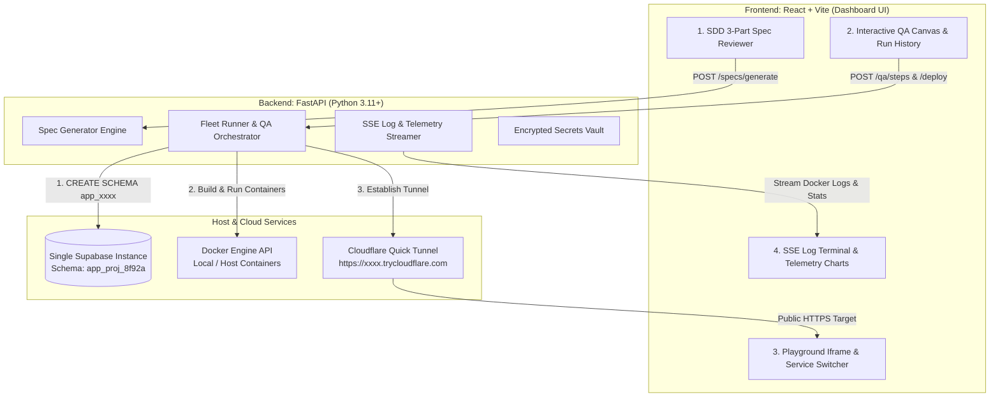

# Product Requirement Document (PRD) — FlashMVP
> **Version:** 1.0.0 (3-Day Hackathon Edition)  
> **Target Stack:** React.js + FastAPI + Supabase PostgreSQL + Docker Engine API + Cloudflared  
> **Repository:** `FlashMVP`

---

## 1. Product Vision & Strategic Goals

**FlashMVP** is an end-to-end platform for AI-assisted specification, instant containerized deployment, isolated database backend provisioning, and real-time monitoring of full-stack web applications.

During a 3-day hackathon sprint, **DevOps friction is the primary failure mode**. Rather than struggling with AWS IAM permissions, multi-minute cloud database provisioning spinners, or complex observability stacks, FlashMVP provides a **zero-friction single-host runtime architecture** with high-visual-impact UI feedback loops.

### Primary Operational Goals:
1. **Zero-DevOps Instant Deployment:** Deploy user web applications as isolated Docker containers within 5 seconds on a target host machine or VPS.
2. **Sub-200ms Database Provisioning:** Automatically create isolated PostgreSQL schemas (`CREATE SCHEMA app_xxxx`) inside a single pre-created Supabase project within 200ms.
3. **Specs-Driven AI Collaboration (SDD):** Intercept autonomous code generation by requiring explicit human sign-off on AI-drafted Requirements, Technical Design, and Task Breakdown before any code is generated or executed.
4. **Transparent Container Observability:** Stream raw Docker build logs and stdout/stderr container logs via Server-Sent Events (SSE), alongside real-time CPU % and Memory MB charts.
5. **Interactive Container Playground:** Provide an embedded web preview iframe with simulated browser address bar, Cloudflare Quick Tunnel SSL public links (`https://xxxx.trycloudflare.com`), and a multi-service switcher toolbar (`Frontend App`, `Backend API /docs`, `Supabase DB`).
6. **Vercel / GitHub Actions Style Workflow History:** Maintain a complete audit log of past deployment attempts (`Run #14 - Passed`, `Run #13 - Failed`) with detailed step-by-step trace inspectors.
7. **Centralized Portfolio Governance (xAppHub):** Single-pane-of-glass administrative portal to publish apps, manage Role-Based Access Control (RBAC), and view adoption analytics.

---

## 2. Core Functional Requirements (FR)

### FR1: Specs-Driven Development (SDD)
* **AI Spec Drafting:** Upon receiving a user prompt and stack template choice (`react-fastapi`), the platform generates a 3-part artifact bundle:
  * **Requirements:** Functional user stories and business rules in Markdown format.
  * **Technical Design:** Full-stack architecture notes, database schema, and endpoint specs in Markdown format.
  * **Task Breakdown:** Array of sequential execution step objects (`{ id, description, completed }`).
* **Revision Feedback Loop:** User can provide corrective text instructions (e.g., `"Use Postgres instead of MongoDB"`). The system re-generates affected sections while preserving intact tasks.
* **Approval Locking:** User clicks **"Approve Specs"** (`POST /api/v1/specs/approve`), locking specification controls into read-only mode and unlocking the deploy pipeline.

### FR2: Dynamic Supabase Database Isolation
* **Multi-Schema Provisioning:** Upon project creation (`POST /api/v1/projects/create`), FastAPI executes async SQL:
  ```sql
  CREATE SCHEMA IF NOT EXISTS app_{project_id};
  CREATE TABLE IF NOT EXISTS app_{project_id}.users (
      id UUID PRIMARY KEY DEFAULT gen_random_uuid(),
      email TEXT UNIQUE NOT NULL,
      created_at TIMESTAMPTZ DEFAULT NOW()
  );
  ```
* **Execution Performance:** Completes in `< 200ms` vs. 60-120s for full cloud project provisioning.
* **Transparent Timing UI:** Dashboard explicitly displays timing metrics (`[✓] Executed SQL: CREATE SCHEMA app_proj_8f92a (0.18s)`).

### FR3: Expandable Architecture & Manifest (`flashmvp.json`)
* **Starter Scaffolding:** Includes pre-configured starter templates (`React + FastAPI`, `Next.js + Go`) with local Git repository initialization.
* **Manifest Parser:** Reads `flashmvp.json` repository manifests declaring service names, Dockerfiles, dynamic ports, and QA pipeline steps.
* **Multi-Container Docker Networks:** FastAPI creates isolated Docker bridge networks (`net_{project_id}`), launching multi-container fleets (`frontend` on port 3001, `backend` on port 8001) connected to the project's Supabase schema.

### FR4: Interactive QA Pipeline Workflow & Run History
* **Visual Node Canvas:** Displays QA workflow as connected visual nodes (`Step 1: ESLint` ➔ `Step 2: Pytest` ➔ `Step 3: Secret Scan`).
* **Right-Click Context Menu:** Users right-click canvas to open context menu (`➕ Add Custom QA Step`), configuring step name and shell command (`npm run test:e2e`).
* **Vercel / GitHub Actions Style Run History:** Audit log table recording past deployment runs (`Run #14 - 🟢 Passed (32s ago)`). Clicking a row opens a slide-over drawer showing archived logs and step pass/fail snapshots.

### FR5: Container Playground & Cloudflare Tunnels
* **Embedded Preview Window:** Renders `<iframe src={preview_url} />` inside a mock browser window frame with URL bar (`https://app-8f92a.trycloudflare.com`) and viewport size toggles (`Desktop`, `Mobile 375px`).
* **Cloudflare Quick Tunnels:** FastAPI executes `cloudflared tunnel --url http://localhost:3001`, generating an instant SSL-encrypted public URL (`https://xxxx.trycloudflare.com`) in 1-2 seconds with zero interstitial warning screens.
* **Multi-Service Switcher:** Tabs to toggle iframe preview target: `🌐 Frontend App`, `⚙️ Backend API (/docs)`, `🛢️ Supabase DB`.

### FR6: Fleet Observability & Log Streaming
* **Container Fleet Status:** Lists active containers (`frontend`, `backend`) with health badges (`🟢 RUNNING`, `🔴 CRASHED`).
* **Per-Container Log Viewer:** Dropdown selector to pick any container and view stdout/stderr logs streamed in real time via Server-Sent Events (SSE) (`/api/v1/projects/{id}/containers/{cid}/logs`).
* **Real-time Telemetry:** Polls `container.stats()` every 3 seconds, rendering live CPU % and Memory MB line charts using Recharts.

### FR7: Environment Secrets Management Modal
* **Configuration Modal:** Modal UI dialog for adding, editing, and scoping environment variables (`OPENAI_API_KEY`, `STRIPE_KEY`).
* **Target Scoping:** Keys scoped to `ALL`, `FRONTEND`, or `BACKEND`.
* **Runtime Injection:** Encrypted at rest and passed into container runtimes (`-e KEY=VAL`).

### FR8: Centralized xAppHub Management Portal
* **Application Catalog:** Single-pane-of-glass dashboard displaying grid of published application cards with launch buttons.
* **RBAC Access Control:** Manage user permissions (`Super Admin`, `Developer`, `Viewer`, `Revoked`).
* **Adoption Analytics:** Usage trend graphs for portfolio adoption.

---

## 3. Technology Stack Selection

| Component | Technology | Role |
| :--- | :--- | :--- |
| **Frontend UI** | **React.js + Vite** | Fast HMR, component architecture, state management, live charts |
| **Styling** | **Vanilla CSS + Modern Tokens** | Dark mode glassmorphism, micro-animations, high visual appeal |
| **Backend API** | **FastAPI (Python 3.11+)** | High velocity, async native, auto `/docs` Swagger, Docker Python SDK |
| **Database** | **Supabase (PostgreSQL)** | Single pre-provisioned project with dynamic `app_{id}` schema isolation |
| **Container Engine**| **Docker Engine API** | `docker-py` SDK for container builds, port mapping, and `stats` polling |
| **Tunnel Service** | **Cloudflare Quick Tunnels** | `cloudflared` CLI for free instant HTTPS public URLs (`*.trycloudflare.com`) |
| **Log Streaming** | **FastAPI SSE** | Server-Sent Events streaming container `stdout`/`stderr` logs |

---

## 4. System Architecture Diagram



---

## 5. Directory Structure & Feature Backlogs

```
FlashMVP/
├── client/                              # React + Vite Frontend Application
├── server/                              # FastAPI Python Backend Application
├── docs/                                # Project Specifications & Documentation
│   ├── prd.md                           # Master Product Requirement Document
│   ├── architecture-system-design.md    # Detailed Technical Architecture Specification
│   ├── knowledge/past-discussion.md     # Hackathon Feasibility Analysis
│   └── backlogs/                        # Feature-Driven Backlogs Directory
│       ├── README.md                    # Master Backlog Index & Role Distribution
│       ├── 10-specs-driven-development/ # Feature 1: SDD Engine & 3-Part Reviewer UI
│       ├── 20-application-infrastructure/ # Feature 2: Supabase Schema & Encrypted Secrets
│       ├── 30-expandable-architecture/  # Feature 3: Template Generator & Multi-Container Network
│       ├── 40-qa-pipeline-workflow/     # Feature 4: Interactive QA Canvas & Run History
│       ├── 50-container-playground-observability/ # Feature 5: Iframe Playground & SSE Logs
│       └── 60-xapphub-management-portal/ # Feature 6: Application Catalog & RBAC
└── START_HERE.md                        # Master Onboarding Guide for AI Agents & Developers
```
