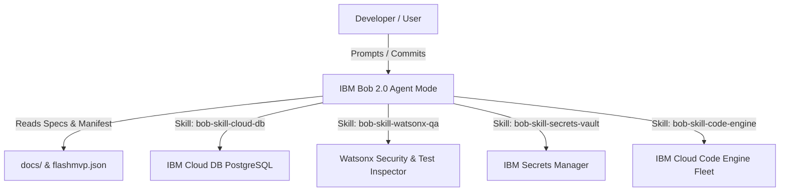

# System Architecture & Technical Design

## 1. Overview

This document details the multi-container fleet topology, IBM Cloud integration, and subagent task delegation for this application.

---

## 2. IBM Bob Subagent Swarm Topology

---

## 3. Technology Stack

* **Frontend**: React 18 + TypeScript + Vite
* **Backend**: FastAPI Python 3.11 + Pydantic + Uvicorn
* **Database**: IBM Cloud Databases for PostgreSQL (Schema `app_<id>`)
* **Deployment**: IBM Cloud Code Engine (Region `us-south`)
